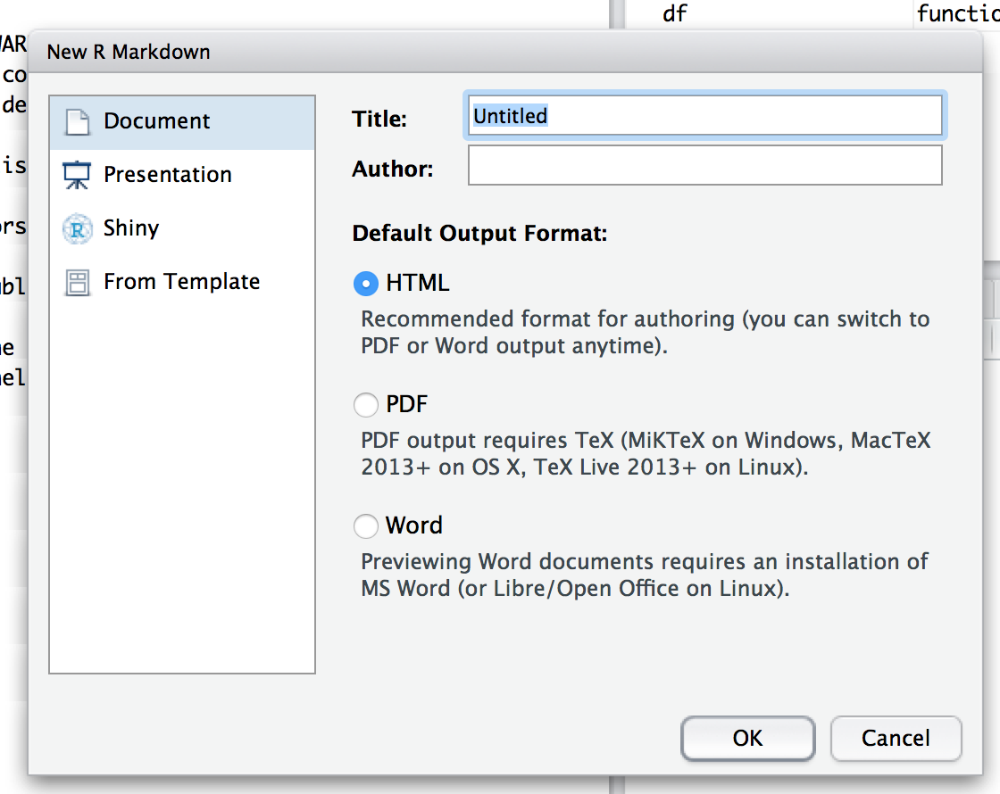
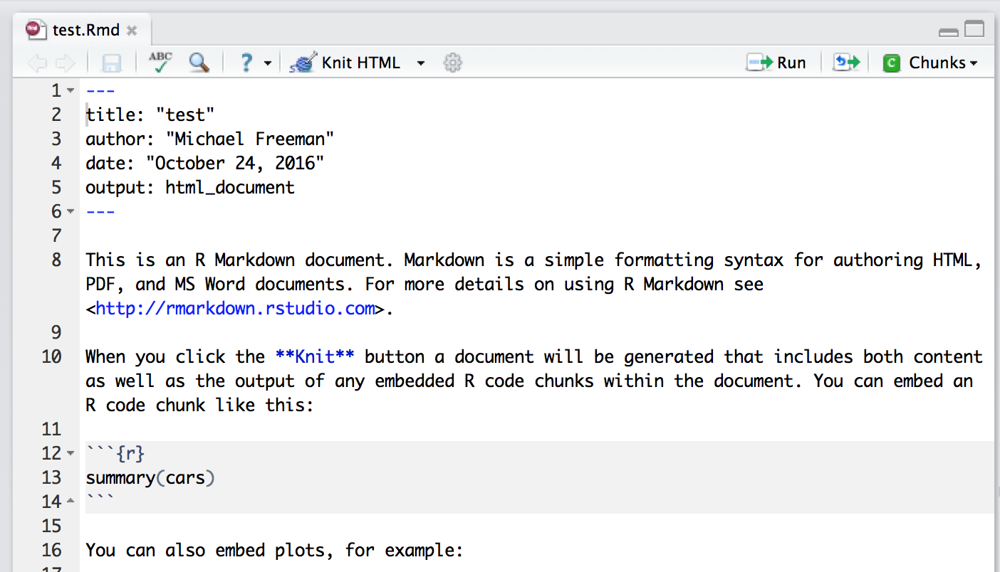

# Module 11: R Markdown


## Overview
R Markdown provides an extraordinary framework for dynamically creating documents, such as websites (`.html`), reports (`.pdf`), or slideshows (`ioslides/slidy`). The ability to generate such reports using analytical software eliminates the need to manually update the _results_ of a research project. As you may have guessed, R Markdown provides an ability to blend Markdown syntax and R code that, when executed, enable you to inject your results into a beautifully formatted document.  

<!-- START doctoc -->
<!-- END doctoc -->

## Resources
- [R Markdown Homepage](http://rmarkdown.rstudio.com/)
- [R Markdown Cheatsheet](https://www.rstudio.com/wp-content/uploads/2016/03/rmarkdown-cheatsheet-2.0.pdf)
- [R Markdown Reference](https://www.rstudio.com/wp-content/uploads/2015/03/rmarkdown-reference.pdf)

## Getting Started
The easiest way to start using R Markdown is by creating a new `.Rmd` document from within R Studio. Using your **File** menu, you'll want to create a new document:


Once you've chosen _R Markdown_ as your desired file type, you'll be prompted to choose a default _document type_ and _output format_ that you would like to create. In this module, we'll discuss creating `.html` documents (websites):



Once you have chosen your desired document type and output format, R Studio will create open up a new text document with extension `.Rmd` with sample code for you to get started with:



## R Markdown Syntax
Once you have your `.Rmd` file open in R Studio, you're ready to start writing R Markdown code. The section at the top inside the dash block (`---`) contains meta-information about how you would like to render your document. After this section, you can begin writing Markdown code using (largely) the same syntax you learned in [module-3](https://github.com/INFO-201/m3-markdown).

### Code Chunks
What makes R Markdown distinct from simple Markdown code is the ability to actually **execute your R code**, both inline or inside of code blocks. To execute a code block, simply include `{r}` after the start of your three back-ticks (\`\`\`). For example

```
Write some *markdown* out here, then create a code block:
```{r}
# Execute r code in here
x <- 1
``` # end with three back ticks
Back to writing _markdown_ out here.
```

Most of the configuration you'll want to do is inside the curly braces when you start your code (`{r, OPTIONS}`). The options that you specify will dictate what gets printed to the screen upon document creation. The [cheatsheet](https://www.rstudio.com/wp-content/uploads/2016/03/rmarkdown-cheatsheet-2.0.pdf) provides a more robust list, but most often you'll be adusting:

> **eval**: Whether or not you want the code to be evaluated (default=TRUE). This may be helpful if you want to show someone the code you wrote, but don't want to execute it

> **echo**: Whether or not you want the results to be included in the document (default=TRUE). This may be useful if you want to show a graph, or the result of your calculation.

Note, to suppress other information from being included in the final document, you may have to adjust other options such as `message` or `warning`.

### Inline Code
In addition to creating distinct code blocks, you may want to execute r code _inline_ with the rest of your text. As with code blocks, you'll follow the Markdown convention of using single back-ticks, and simply follow your first backtick with the letter `r`. For example:

```
Here you are writing a report, and then you can run inline R code. Like if you wanted to calculate 3 + 4, you could do it like this: `r 3 + 4`
```
When you compile the section above, the `r 3 + 4` would be replaced with the number `7`. Note, you can also reference values computed in the code blocks preceding your inline code.

## Compiling Documents
Compiling documents in through the R Studio interface is quite simple. Simply click the `knit` button at the top of your code editor, and your document will be created (in the same directory as your `.Rmd` file):


While this is easy to initialize, you may find yourself encountering syntax errors, which can be a bit hard to debug. I suggest you compile your document somewhat frequently, and pay close attention to any error messages that appear in your console.

## Making Websites
Assuming that you've chosen `.html` as your desired output type, R Studio will compile your code into a document that represents a website. HTML stands for _HyperText Markup Language_, which is a syntax for creating documents that can be rendered by web browsers. HTML code is in may ways similar to Markdown, in that each visible element on the page is represented in the code, along with syntax that describes how elements should be rendered (though HTML is _far more_ extensive than Markdown).

R Studio will provide a preview of your `.html` documents, but you can also open the file in a web browser. However, you likely want to share your website you create with the rest of the world. To do that, we can use a few tricks to get GitHub to host websites.

### Using GitHub to Host Websites
In addition to hosting code files, GitHub also will host static web content **for free**. If you create the proper _branch name_ (see below), GitHub will automatically start serving your website at the appropriate URL. If you ever see a website with `USERNAME.github.io/PROJECT`, you should be able to find the code at `github.com/USERNAME/PROJECT`. For example, the website http://facebook.github.io/origami/ has the corresponding `index.html` file at https://github.com/facebook/origami/.

### Branches
All quarter, we've subtly been using the concept of GitHub _branches_ to keep a `master` and `complete` version of the exercises. Branches allow you to create separate streams of development on a single project. This is often used for more robust or collaborative projects, but in this case, we really just want to create a second branch with the _same content_ in it.

You can create a branch off of an existing branch using the following command:

```bash
git checkout -b branch-name
```
That creates a branch with name `branch-name`. You can easily switch back to your master branch using the following command:

```bash
git checkout master
```
Note, the `-b` in the first code section indicated that you wanted to create a new branch. For our purposes, we'll want to create a branch with name `gh-pages`, and make sure to **push it** up to GitHub:

```bash
git checkout -b gh-pages
git push origin --all # alternatively, git push origin complete
```

Make sure to keep track of which branch your on using `git status`. For this flow of development, I suggest that you always work on your master branch, and if you make changes, simply **merge** them into your `complete` branch:

```bash
# Create gh-pages branch from master branch
git checkout -b gh-pages

# Switch back to master branch
git checkout master

# Make some changes, then add and commit as usual
git add .
git commit -m "Made more changes here on the master branch"

# Switch back to your gh-pages branch
git checkout gh-pages

# Merge in your changes into your gh-pages branch from your master branch
git merge master

# Push all changes up to GitHub
git push origin --all
```

We'll discuss more advanced Git approaches in future modules, but to keep this workflow, you should **not make changes on your gh-pages branch**.
